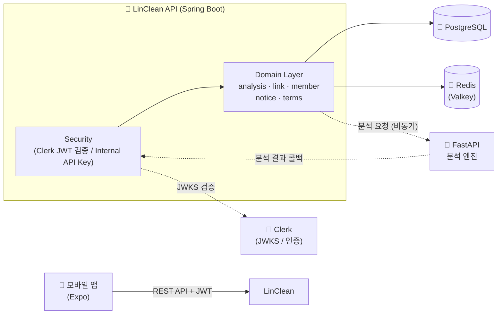

<div align="center">

# 🧹 LinClean API

**링크 저장 · AI 분석 모바일 서비스의 백엔드 REST API 서버**

[](https://openjdk.org/projects/jdk/21/)
[](https://spring.io/projects/spring-boot)
[](https://www.postgresql.org/)
[-DC382D?style=flat-square&logo=redis&logoColor=white)](https://valkey.io/)
[](https://gradle.org/)
[](https://www.docker.com/)

[](https://github.com/403-Forb2dden/LinClean-BE-spring/actions/workflows/CI.yml)
[](https://github.com/403-Forb2dden/LinClean-BE-spring/actions/workflows/CD.yml)

</div>

---

## 📖 프로젝트 소개

**LinClean**은 사용자가 저장한 링크(URL)를 카테고리별로 관리하고, AI 분석 엔진을 통해 링크를 분석·분류해 주는 모바일 서비스입니다.

이 레포지토리(`linclean-api`)는 그중 **백엔드 REST API 서버**로, 모바일 앱(Expo)의 요청을 처리하고 회원·링크·분석·약관·공지 도메인을 관리합니다. 인증은 **Clerk(OAuth2 JWT)** 로 위임하고, 링크 분석은 별도의 **FastAPI 분석 엔진**과 비동기로 연동합니다.

## ✨ 주요 기능

- **🔗 링크 관리** — 링크 저장/조회/삭제, 북마크·카테고리·제목 수정, 중복 확인
- **🗂️ 카테고리 관리** — 카테고리 생성/조회/수정/삭제
- **🤖 AI 분석** — 분석 요청, 분석 결과 조회, 분석 통계 집계 (FastAPI 분석 엔진과 비동기 연동 + 내부 콜백 수신)
- **👤 회원 관리** — Clerk 기반 회원 동기화, 회원 탈퇴 시 *Soft Delete → 보존 기간 경과 후 Hard Delete* 스케줄링
- **📜 이용약관 / 📢 공지사항** — 약관 타입별 조회, 공지 목록·상세 조회
- **🔐 인증·보안** — Clerk OAuth2 JWT 검증, 내부 통신용 API Key 필터(`InternalApiKeyFilter`)
- **📊 로깅·모니터링** — Logback + Logstash JSON 파일 로깅, 에러 발생 시 **Discord 웹훅 알림**, Actuator 헬스 체크

## 🛠️ 기술 스택

| 구분 | 기술 |
| --- | --- |
| **Language** | Java 21 (LTS) |
| **Framework** | Spring Boot 3.5.13, Spring MVC (Spring Web), Spring Security |
| **HTTP Client** | Spring WebClient (외부 분석 엔진·Clerk API 호출용) |
| **Auth** | OAuth2 Resource Server (JWT) · Clerk |
| **Database** | PostgreSQL, Spring Data JPA (Hibernate), Flyway (마이그레이션) |
| **Cache** | Redis (Valkey 호환), Spring Data Redis |
| **API Docs** | SpringDoc OpenAPI 2.8.6 (Swagger UI) |
| **Logging** | Logback + Logstash Logback Encoder (JSON), Discord Webhook |
| **Build** | Gradle 8.14.4 |
| **Test** | JUnit 5, Spring Boot Test, Testcontainers (PostgreSQL), OkHttp MockWebServer |
| **Infra** | Docker (멀티스테이지 빌드), GitHub Actions (CI/CD), AWS EC2 + SSM |

## 🏗️ 시스템 아키텍처



## 📂 프로젝트 구조

```
src/main/java/com/linclean
├── LincleanApiApplication.java      # 애플리케이션 진입점
├── domain                          # 비즈니스 도메인 (controller·service·entity·dto·repository)
│   ├── analysis                    #   링크 분석 요청·결과·통계
│   ├── link                        #   저장 링크 & 카테고리
│   ├── member                      #   회원 관리·탈퇴 스케줄링
│   ├── notice                      #   공지사항
│   ├── terms                       #   이용약관
│   ├── device                      #   기기 정보
│   └── notification                #   알림
├── security                        # 인증 주체(MemberPrincipal) / 인증 엔드포인트
└── global                          # 공통 기능
    ├── config                      #   Security·Redis·Swagger·Async·WebClient 등 설정
    ├── entity                      #   BaseEntity (Auditing)
    ├── web                         #   공통 응답 포맷(ApiResponse)
    ├── exception                   #   전역 예외 처리(GlobalExceptionHandler·ErrorCode)
    ├── log                         #   JSON 로그 / Discord 웹훅 Appender
    └── security                    #   InternalApiKeyFilter (내부 통신 인증)

src/main/resources
├── application.yml                 # 메인 설정 (+ dev / prod / test 프로필)
├── logback-spring.xml              # 로깅 설정
└── db/migration                    # Flyway 마이그레이션 스크립트
```

## 🚀 시작하기

### 사전 요구사항

- **JDK 21**
- **PostgreSQL**, **Redis(Valkey)** — 로컬 설치 또는 Docker
- **Clerk** 인증 키, **FastAPI 분석 엔진** 엔드포인트 (외부 연동)

### 환경 변수

루트에 `.env` 파일을 생성합니다 (`application.yml`이 `optional:file:.env`로 로드).

| 키 | 설명 |
| --- | --- |
| `SPRING_PROFILES_ACTIVE` | 활성 프로필 (`dev` / `prod` / `test`) |
| `API_PORT` | 서버 포트 |
| `POSTGRES_HOST` · `POSTGRES_PORT` · `POSTGRES_DATABASE` · `POSTGRES_USER` · `POSTGRES_PASSWORD` | PostgreSQL 연결 정보 |
| `REDIS_HOST` · `REDIS_PORT` · `REDIS_PASSWORD` | Redis(Valkey) 연결 정보 |
| `CLERK_JWKS_URI` · `CLERK_ISSUER` · `CLERK_SECRET_KEY` | Clerk OAuth2 JWT 설정 |
| `ANALYSIS_ENGINE_URL` | FastAPI 분석 엔진 Base URL |
| `ANALYSIS_ENGINE_CONNECT_TIMEOUT_MS` · `ANALYSIS_ENGINE_READ_TIMEOUT_S` | 분석 엔진 통신 타임아웃 (기본 3000ms / 5s) |
| `INTERNAL_API_KEY` | 내부 통신(분석 엔진 ↔ Spring) 인증 키 |
| `MEMBER_WITHDRAWAL_RETENTION_DAYS` | 탈퇴 회원 보존 기간 (기본 30일) |
| `MEMBER_WITHDRAWAL_HARD_DELETE_CRON` | Hard Delete 스케줄 cron (기본 매일 03:00) |
| `DISCORD_WEBHOOK_URL` | 에러 로그 Discord 알림 웹훅 URL |

### 빌드 & 실행

```bash
# 빌드
./gradlew build

# 로컬 실행
./gradlew bootRun

# 또는 JAR 직접 실행
java -jar build/libs/linclean-api-0.0.1-SNAPSHOT.jar
```

### Docker 실행

```bash
docker build -t linclean-api .
docker run -p 8080:8080 --env-file .env linclean-api
```

### Spring 프로필

| 프로필 | 용도 |
| --- | --- |
| `dev` | 로컬 개발 (SQL 로깅·Swagger 활성, 기본값) |
| `prod` | 운영 (Graceful shutdown 등) |
| `test` | 테스트 (Testcontainers 기반) |

## 📑 API 문서

애플리케이션 실행 후 Swagger UI에서 전체 API 명세를 확인할 수 있습니다.

- **Swagger UI**: `http://localhost:{API_PORT}/swagger-ui.html`
- **OpenAPI Docs**: `http://localhost:{API_PORT}/v3/api-docs`

### 주요 엔드포인트

| 도메인 | Method & Path | 설명 |
| --- | --- | --- |
| 인증 | `GET /api/v1/auth/me` | 내 인증 정보 조회 |
| 분석 | `POST /api/v1/analyses` | 링크 분석 요청 |
| 분석 | `GET /api/v1/analyses/statistics` | 분석 통계 조회 |
| 분석 | `GET /api/v1/analyses/{analysisId}` | 분석 결과 조회 |
| 링크 | `POST·GET /api/v1/saved-links` | 링크 저장 / 목록 조회 |
| 링크 | `GET /api/v1/saved-links/check` | 링크 중복 확인 |
| 링크 | `PATCH /api/v1/saved-links/{id}/{bookmark\|category\|title}` | 북마크·카테고리·제목 수정 |
| 링크 | `DELETE /api/v1/saved-links/{id}` | 링크 삭제 |
| 카테고리 | `POST·GET /api/v1/categories` | 카테고리 생성 / 목록 조회 |
| 카테고리 | `PATCH·DELETE /api/v1/categories/{id}` | 카테고리 수정 / 삭제 |
| 회원 | `DELETE /api/v1/members/me` | 회원 탈퇴 |
| 약관 | `GET /api/v1/terms/{type}` | 약관 타입별 조회 |
| 공지 | `GET /api/v1/notices` · `GET /api/v1/notices/{id}` | 공지 목록 / 상세 조회 |
| 헬스 | `GET /actuator/health` | 헬스 체크 |

> `POST /internal/analysis-result` 등 `/internal/**` 경로는 분석 엔진과의 내부 통신 전용으로, `INTERNAL_API_KEY`로 보호됩니다.

## 🧪 테스트

```bash
./gradlew test
```

> 통합 테스트는 **Testcontainers(PostgreSQL)** 를 사용하므로 실행 환경에 **Docker**가 필요합니다.

## 🔄 CI/CD

GitHub Actions로 빌드·배포를 자동화합니다.

- **CI** (`.github/workflows/CI.yml`) — `dev`/`main` push 및 `dev` 대상 PR에서 Gradle 테스트 실행
- **CD** (`.github/workflows/CD.yml`) — `main` CI 성공 시 Docker 이미지를 빌드해 Docker Hub에 푸시하고, **AWS SSM**으로 EC2에서 `docker compose`를 통해 무중단 배포

> 배포 아키텍처 상세는 [`docs/배포.md`](docs/배포.md)를 참고하세요.

## 📝 컨벤션

- **커밋 컨벤션**: [`docs/commit.md`](docs/commit.md) 참고
- **브랜치 전략**: 기능 브랜치 → `dev`(PR base) → `main`(배포)
